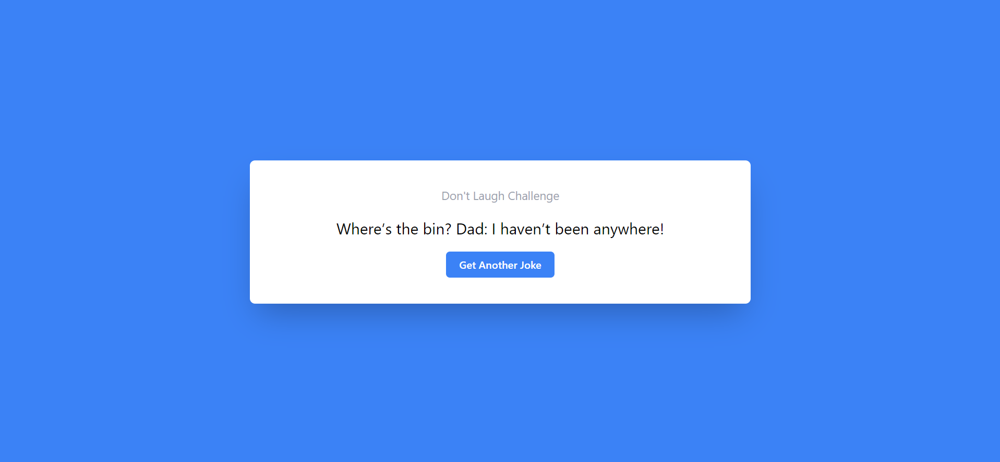

# joke-generator

## Table of Contents
* [Overview](#overview)
* [Process](#process)
* [References](#references)
* [Author](#author)

## Overview
> Joke generator is a simple website which generates random jokes.

### Screenshots
#### 1) Desktop

#### 2) Mobile  

### You can watch Live demo [_here_](https://joke-generator-two.vercel.app/).

## Process

### Built With
- HTML
- CSS
- Tailwind CSS
- JavaScript

### What I Learned
- Learned to fetch data from API endpoints.
- Learned to display feteched data from API using HTML, CSS/TailwindCSS and JavaScript.

## References
- [TailwindCSS](https://tailwindcss.com/)
- [MDN](https://developer.mozilla.org/en-US/)
- [w3schools](https://www.w3schools.com/)
- [JavaScript](https://javascript.info/)
- [API](https://icanhazdadjoke.com/api)

## Author

[Website](https://kedarmakode.com/)

[Linkedin](https://www.linkedin.com/in/kedar-makode-9833321ab)

[Twitter](https://twitter.com/Kedar__98)

[Instagram]()

kedarmakode1598@gmail.com
